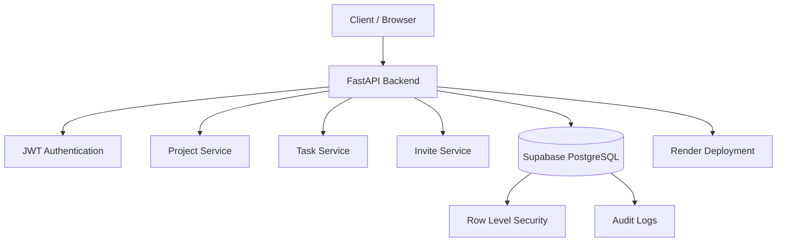

# Multi-Tenant SaaS Backend (FastAPI + Supabase + RLS)


A **secure multi-tenant SaaS backend** for **project and task management** built using **FastAPI**, **PostgreSQL (Supabase)**, **Row Level Security (RLS)**, **Docker**, and deployed on **Render**.

The system supports **organization-based collaboration**, **invite onboarding**, **project and task management**, **audit logging**, and **database-level tenant isolation**.

---

# 🌐 Live Demo

API Base URL

```
https://multi-tenant-saas-rls.onrender.com
```

Swagger API Docs

```
https://multi-tenant-saas-rls.onrender.com/docs
```

Health Check

```
https://multi-tenant-saas-rls.onrender.com/health
```

---

# ⚡ Quick Start

Clone the repository

```
git clone https://github.com/YOUR_USERNAME/multi-tenant-saas-fastapi-rls.git
cd multi-tenant-saas-fastapi-rls
```

Run using Docker

```
docker compose up --build
```

Open API documentation

```
http://localhost:8000/docs
```

---

# 🚀 Key Features

### Multi-Tenant SaaS Architecture

* Organizations act as isolated tenants
* Users belong to organizations
* All data is scoped by tenant

### Row Level Security (RLS)

* Implemented directly in PostgreSQL
* Prevents cross-tenant data access
* Security enforced at the database layer

### Invite-Based Onboarding

* Organization admins invite members
* Users securely join via email invite

### Project Management

* Create and manage projects
* Organization-level collaboration

### Task Management

* Create and update tasks within projects
* Track task progress and status

### Audit Logging

* Database trigger logs important changes
* Enables activity history tracking

### Project Analytics

Endpoint returning task statistics:

```
GET /projects/{id}/stats
```

Example response

```
{
  "todo": 5,
  "in_progress": 3,
  "done": 10
}
```

### Dockerized Backend

* Reproducible development environment
* Consistent runtime across machines

### Continuous Integration

* GitHub Actions CI pipeline
* Syntax validation
* Import verification

---

# 🧱 System Architecture



---

# 🛠 Tech Stack

### Backend

* FastAPI
* Python 3.11

### Database

* PostgreSQL
* Supabase

### Security

* JWT Authentication
* Row Level Security (RLS)

### Infrastructure

* Docker
* Docker Compose
* Render Deployment

### DevOps

* GitHub Actions CI

---

# 📂 Project Structure

```
multi-tenant-saas-fastapi-rls
│
├── backend
│   ├── routers
│   │   ├── auth.py
│   │   ├── projects.py
│   │   ├── tasks.py
│   │   └── invites.py
│   │
│   ├── main.py
│   ├── database.py
│   ├── requirements.txt
│   └── Dockerfile
│
├── docker-compose.yml
├── .dockerignore
├── .github
│   └── workflows
│       └── ci.yml
│
└── README.md
```

---

# 🔐 Multi-Tenant Data Isolation

Tenant security is enforced using **PostgreSQL Row Level Security (RLS)**.

Every query automatically filters data based on the user's organization.

Example concept

```
SELECT * FROM projects
WHERE org_id = current_user_org_id
```

Benefits

* Database-level security
* Prevents cross-tenant data access
* Defense-in-depth architecture

---

# 📡 Core API Endpoints

### Authentication

```
POST /signup
POST /login
```

### Projects

```
POST /projects
GET /projects
PUT /projects/{id}
DELETE /projects/{id}
```

### Tasks

```
POST /tasks
GET /tasks
PUT /tasks/{id}
DELETE /tasks/{id}
```

### Invites

```
POST /invites
POST /accept-invite
```

### Analytics

```
GET /projects/{id}/stats
```

### Task Activity History

```
GET /tasks/{task_id}/history
```

---

# 🔄 Example Request Flow

### Creating a Task

```
Client
   ↓
POST /tasks
   ↓
FastAPI Authentication Middleware
   ↓
JWT validated
   ↓
User organization identified
   ↓
Database query executed
   ↓
PostgreSQL RLS verifies tenant access
   ↓
Task inserted
   ↓
Audit log recorded
   ↓
Response returned
```

---

# ⚙ Environment Variables

Create a `.env` file inside the backend directory.

Example

```
SUPABASE_URL=your_supabase_url
SUPABASE_ANON_KEY=your_anon_key
SUPABASE_SERVICE_KEY=your_service_key
```

---

# 🔄 Continuous Integration

GitHub Actions automatically runs on

* push to `main`
* pull requests

Pipeline steps

* install dependencies
* syntax validation
* import verification
* environment variable injection

This ensures broken code cannot enter the main branch.

---

# ☁ Deployment

The backend is deployed on **Render**.

Deployment pipeline

```
GitHub Push
   ↓
Render Auto Deploy
   ↓
Docker Build
   ↓
FastAPI Container
   ↓
Live API
```

Database is hosted on **Supabase PostgreSQL**.

---

# 👩‍💻 Author

Backend engineering project demonstrating

* secure multi-tenant architecture
* database-level tenant isolation
* containerized deployment
* CI automation
